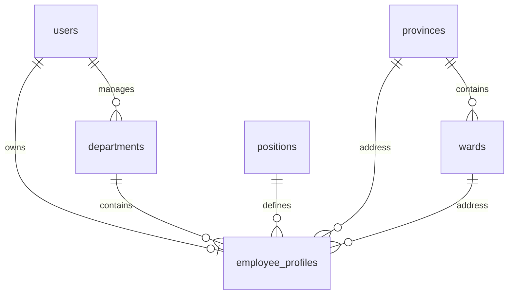
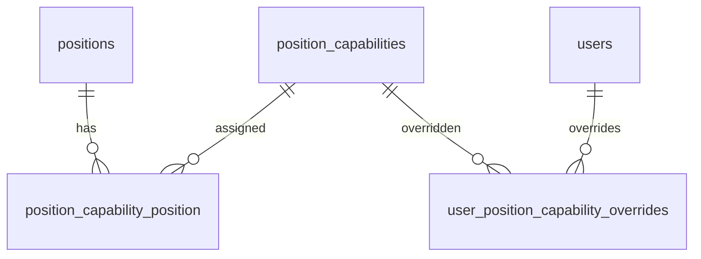
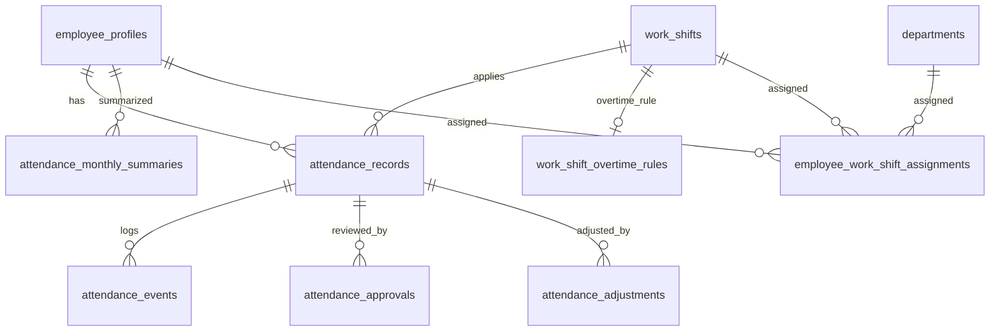
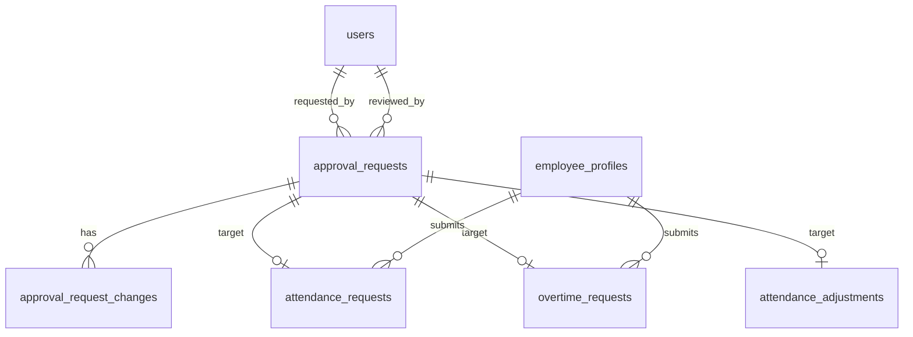
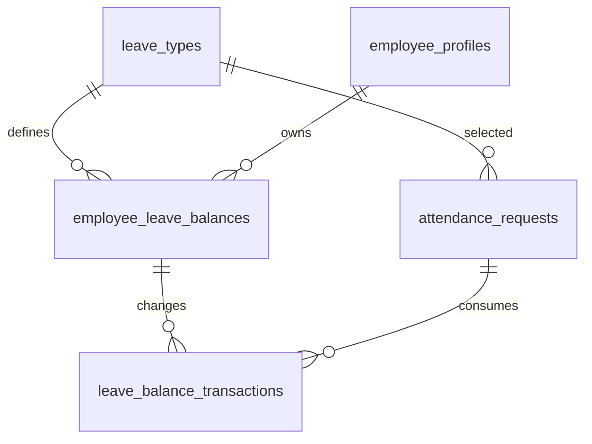
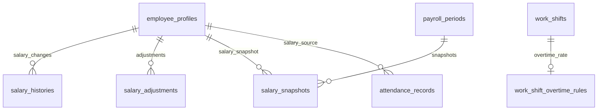
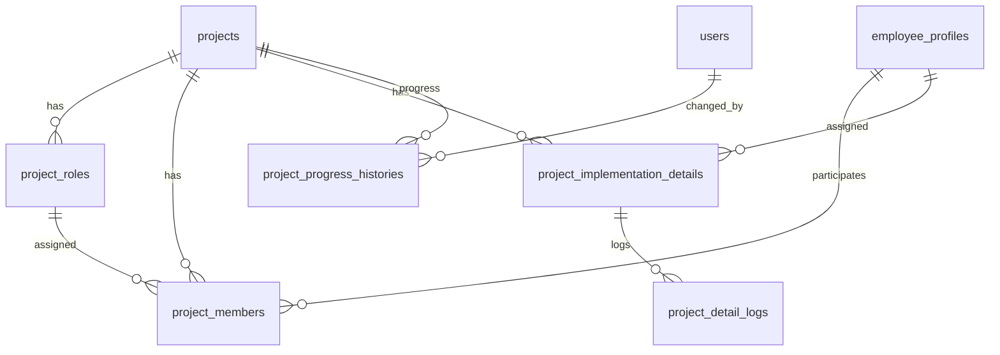
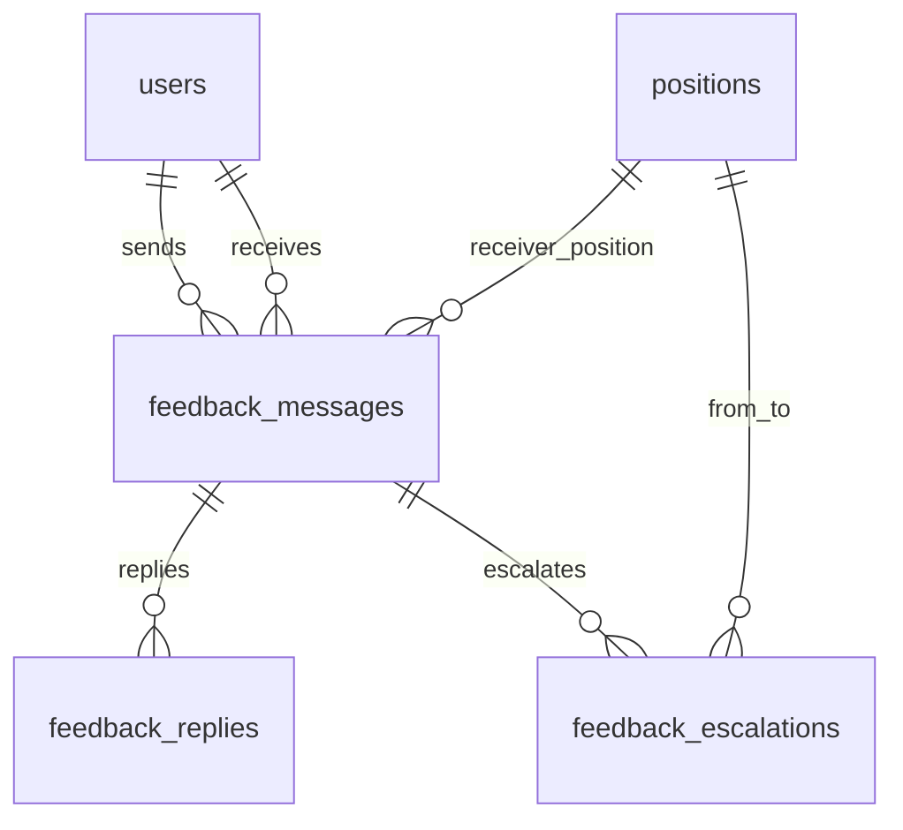
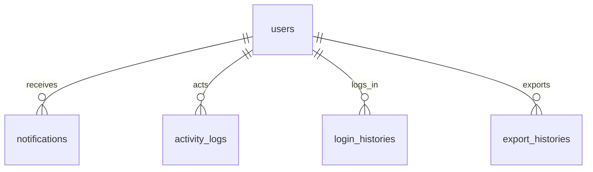

# Ban Do Database HRM

Tai lieu nay mo ta vai tro tung nhom bang va quan he chinh giua cac bang trong he thong. Nguon tham chieu chinh la `database/migrations` va cac relation trong `app/Models`.

## 1. Truc Du Lieu Trung Tam

He thong xoay quanh `users` va `employee_profiles`.

| Bang | Vai tro | Quan he chinh |
| --- | --- | --- |
| `users` | Tai khoan dang nhap, email, phone, trang thai tai khoan | 1-1 voi `employee_profiles`, 1-N voi notification, OTP, session |
| `employee_profiles` | Ho so nhan su: ma NV, phong ban, chuc vu, luong co ban, ngay vao lam | N-1 `users`, `departments`, `positions`, `provinces`, `wards`; 1-N cham cong, du an, luong, phep |
| `departments` | Phong ban | 1-N `employee_profiles`, N-1 `users` qua `manager_user_id` |
| `positions` | Chuc vu/cap bac | 1-N `employee_profiles`, N-N `position_capabilities` |
| `provinces` | Tinh/thanh | 1-N `wards`, 1-N `employee_profiles` |
| `wards` | Xa/phuong | N-1 `provinces`, 1-N `employee_profiles` |

Ghi chu: `districts` da bi drop trong migration `2026_04_20_180000_drop_districts_and_roles_tables.php`, khong nen tiep tuc phat trien tinh nang dua vao bang nay.



## 2. Phan Quyen Theo Chuc Vu

Day la he quyen dang duoc dung chinh trong code, thay cho role Spatie.

| Bang | Vai tro | Quan he chinh |
| --- | --- | --- |
| `position_capabilities` | Danh muc quyen: `approve_attendance`, `manage_projects`, `manage_salary` | N-N voi `positions` |
| `position_capability_position` | Pivot gan quyen cho chuc vu | FK den `positions`, `position_capabilities` |
| `user_position_capability_overrides` | Bat/tat quyen rieng cho tung user | N-1 `users`, N-1 `position_capabilities` |
| `authority_levels` | Dinh nghia rank/cap bac | Duoc dung de rang buoc tao/sua/duyet theo cap |
| `permissions`, `model_has_permissions` | Bang Spatie con sot | Hien khong phai he quyen chinh cua app |



## 3. Cham Cong

Nhom nay la nguon du lieu quan trong nhat cho bang luong.

| Bang | Vai tro | Quan he chinh |
| --- | --- | --- |
| `attendance_records` | Ban ghi cong theo ngay cua moi nhan vien | N-1 `employee_profiles`, N-1 `work_shifts`, 1-N events/approvals/adjustments |
| `attendance_events` | Su kien check-in, check-out, manual update | N-1 `attendance_records`, N-1 `employee_profiles` |
| `attendance_approvals` | Lich su duyet/tu choi ban ghi cong | N-1 `attendance_records`, N-1 `users` |
| `attendance_monthly_summaries` | Tong hop cong theo thang/nhan vien | N-1 `employee_profiles`, unique employee + month + year |
| `attendance_month_locks` | Khoa ky cham cong theo thang/phong ban | N-1 `departments` neu khoa theo phong |
| `attendance_adjustments` | Don de nghi sua cong/check-in/check-out | N-1 `attendance_records`, N-1 `approval_requests` |
| `work_shifts` | Danh muc ca lam | 1-N `attendance_records`, 1-N assignment, 1-1 overtime rule |
| `work_shift_overtime_rules` | Khung OT va don gia OT theo ca | 1-1 `work_shifts` |
| `employee_work_shift_assignments` | Phan ca cho nhan vien/phong ban theo khoang ngay | N-1 `employee_profiles`, `departments`, `work_shifts` |
| `holidays` | Ngay le/ngay nghi co hoac khong tinh luong | Doc khi tinh cong/luong |



## 4. Don Duyet

`approval_requests` la bang tong cho nhieu loai don. Quan he den bang nghiep vu la polymorphic bang `target_type` va `target_id`.

| Bang | Vai tro | Quan he chinh |
| --- | --- | --- |
| `approval_requests` | Phieu de nghi tong: nguoi gui, nguoi duyet, trang thai, target | N-1 `users` requester/reviewer, morph den target |
| `approval_request_changes` | Chi tiet truong thay doi trong don sua thong tin | N-1 `approval_requests` |
| `attendance_requests` | Don cham cong/nghi phep/cong tac/quen cham cong | N-1 `employee_profiles`, N-1 `approval_requests`, N-1 `leave_types` |
| `overtime_requests` | Don tang ca | N-1 `employee_profiles`, N-1 `approval_requests` |
| `attendance_adjustments` | Don chinh sua cong | N-1 `attendance_records`, N-1 `approval_requests` |



## 5. Nghi Phep

Nghi phep duoc luu nhu mot loai `attendance_requests`, sau do tac dong den so du phep.

| Bang | Vai tro | Quan he chinh |
| --- | --- | --- |
| `leave_types` | Danh muc loai nghi: phep nam, nghi benh, khong luong | 1-N `employee_leave_balances`, 1-N `attendance_requests` |
| `employee_leave_balances` | So du phep theo nhan vien + loai phep + nam | N-1 `employee_profiles`, N-1 `leave_types` |
| `leave_balance_transactions` | Lich su cong/tru/giu/hoan phep | N-1 `employee_leave_balances`, N-1 `attendance_requests` |
| `attendance_requests` | Don nghi phep khi `request_type = leave` | N-1 `leave_types`, N-1 `approval_requests` |



## 6. Luong

Luong duoc tinh tu ho so nhan su, cham cong, tang ca, ngay nghi, phu cap/khau tru va snapshot ky luong.

| Bang | Vai tro | Quan he chinh |
| --- | --- | --- |
| `salary_histories` | Lich su thay doi luong co ban | N-1 `employee_profiles`, N-1 `users` approved_by |
| `salary_adjustments` | Phu cap/khau tru thu cong theo thang | N-1 `employee_profiles`, N-1 `users` created/updated |
| `payroll_periods` | Ky luong thang/nam, trang thai khoa/mo | 1-N `salary_snapshots`, N-1 `users` locked/unlocked |
| `salary_snapshots` | Du lieu luong da chot cho tung nhan vien trong ky | N-1 `payroll_periods`, N-1 `employee_profiles` |
| `attendance_records` | Nguon ngay cong, phut cong, OT | Duoc doc khi tinh luong ky chua khoa |
| `work_shift_overtime_rules` | Don gia OT theo ca neu co | Duoc doc khi tinh tien OT |

Ghi chu: he so OT ngay thuong/cuoi tuan/ngay le hien dang hardcode trong `SalaryController`. Neu muon admin sua tren UI, nen dua vao DB.



## 7. Du An

Module du an quan ly thanh vien, vai tro, dau viec va lich su tien do.

| Bang | Vai tro | Quan he chinh |
| --- | --- | --- |
| `projects` | Du an | 1-N roles, members, implementation details, progress histories |
| `project_roles` | Vai tro rieng trong tung du an | N-1 `projects`, 1-N `project_members` |
| `project_members` | Thanh vien tham gia du an | N-1 `projects`, N-1 `employee_profiles`, N-1 `project_roles` |
| `project_implementation_details` | Dau viec trien khai | N-1 `projects`, N-1 `employee_profiles` assignee |
| `project_detail_logs` | Log thay doi dau viec | N-1 `project_implementation_details`, N-1 `users` |
| `project_progress_histories` | Lich su tien do du an | N-1 `projects`, N-1 `users` |



## 8. Feedback, Trao Doi Noi Bo

| Bang | Vai tro | Quan he chinh |
| --- | --- | --- |
| `feedback_messages` | Tin gop y/phan hoi chinh | N-1 `users` sender/receiver, N-1 `positions` receiver_position |
| `feedback_replies` | Reply theo thread | N-1 `feedback_messages`, N-1 `users` |
| `feedback_escalations` | Lich su chuyen cap xu ly feedback | N-1 `feedback_messages`, N-1 `positions` from/to |
| `email_logs` | Log gui email | N-1 `users` sender neu co |



## 9. Thong Bao, Audit, Export

| Bang | Vai tro | Quan he chinh |
| --- | --- | --- |
| `notifications` | Thong bao noi bo | N-1 `users`, co morph `notifiable`/reference tuy payload |
| `activity_logs` | Audit thao tac he thong | N-1 `users` |
| `login_histories` | Lich su dang nhap | N-1 `users` |
| `export_histories` | Lich su xuat file | N-1 `users` |



## 10. Auth Va Ha Tang

| Bang | Vai tro | Ghi chu |
| --- | --- | --- |
| `sessions` | Session neu dung database session | Cau hinh qua `SESSION_DRIVER` |
| `password_reset_tokens` | Token reset password Laravel | Dang duoc dung trong password reset |
| `password_reset_otps` | OTP reset password | Giai phap OTP rieng |
| `login_otps` | OTP dang nhap lan dau | Gan voi `users` |
| `social_accounts` | Lien ket Google/social login | N-1 `users` |
| `jobs`, `job_batches`, `failed_jobs` | Queue database | Nen giu neu gui mail/notification bang queue |
| `cache`, `cache_locks` | Database cache | Chi can neu `CACHE_STORE=database` |
| `site_settings` | Cau hinh website/logo/favicon | Dang duoc `SettingsController` dung |
| `settings` | Model cu `Setting.php` tro den bang nay | Migration hien tai khong tao bang `settings`; nen don dep neu khong dung |

## 11. Quan He Nghiep Vu Quan Trong

### Luong tu cham cong

```text
users
-> employee_profiles
-> attendance_records
-> overtime_requests / attendance_requests
-> salary_adjustments
-> payroll_periods
-> salary_snapshots
```

Y nghia: ky luong chua khoa tinh dong tu `attendance_records`. Khi khoa ky, du lieu duoc dong bang vao `salary_snapshots`.

### Nghi phep

```text
employee_profiles
-> attendance_requests(request_type = leave)
-> approval_requests
-> leave_types
-> employee_leave_balances
-> leave_balance_transactions
```

Y nghia: don nghi phep duoc duyet qua `approval_requests`, sau do tru/hoan so du phep bang transaction.

### Du an

```text
employee_profiles
-> project_members
-> projects
-> project_implementation_details
-> project_detail_logs / project_progress_histories
```

Y nghia: nhan su tham gia du an qua `project_members`, dau viec gan cho nhan su qua `project_implementation_details`.

### Phan quyen

```text
users
-> employee_profiles
-> positions
-> position_capability_position
-> position_capabilities
-> user_position_capability_overrides
```

Y nghia: quyen mac dinh den tu chuc vu, quyen rieng den tu override theo user.

## 12. Cac Diem Can Chu Y Khi Phat Trien Tiep

- Khong phat trien tinh nang moi dua vao `roles`, `model_has_roles`, `role_has_permissions`, `districts` vi da bi drop hoac khong con la he chinh.
- Neu them he so OT co the sua tren UI, nen them cot vao `work_shift_overtime_rules` hoac tao bang `overtime_rate_rules`.
- Neu sua logic tinh cong, can dam bao `attendance_monthly_summaries` duoc refresh lai.
- Neu sua logic luong, can can than voi `salary_snapshots`: ky da khoa phai doc snapshot, khong tinh lai tu du lieu song tru khi co thao tac recalculate co chu dich.
- Neu them bang moi co duyet, nen gan vao `approval_requests` de giu mot luong duyet thong nhat.

## 13. Data Dictionary Chi Tiet

Phan nay di vao tung bang quan trong: cot nao la cot nghiep vu, bang nao ghi du lieu, bang nao doc du lieu, va can can than gi khi sua.

### 13.1 `users`

Vai tro: tai khoan dang nhap trung tam.

Cot quan trong:

| Cot | Y nghia | Luu y |
| --- | --- | --- |
| `id` | Khoa chinh user | Duoc FK tu rat nhieu bang |
| `name` | Ten hien thi | Dung tren UI, email, notification |
| `email` | Email dang nhap | Unique, dung OTP/reset/mail |
| `username` | Ten dang nhap | Unique |
| `phone` | So dien thoai | Nullable unique |
| `password` | Mat khau hash | Khong luu plain text |
| `status` | `active`, `inactive`, `blocked`, `pending` | Anh huong login va trang thai tai khoan |
| `is_employee` | Danh dau user la nhan vien | Bo sung sau migration goc |
| `last_login_at`, `last_login_ip` | Thong tin login gan nhat | Phuc vu audit |
| `creater_id` | User tao tai khoan | Quan he tu tham chieu den `users.id` nhung khong khai FK trong migration goc |

Quan he:

- `users.id` -> `employee_profiles.user_id` la 1-1.
- `users.id` -> `login_otps.user_id`, `login_histories.user_id`, `sessions.user_id`.
- `users.id` -> `approval_requests.requested_by`, `approval_requests.reviewed_by`.
- `users.id` -> `notifications.user_id`.

Nguon ghi/chinh:

- Tao/sua user: `UserController`, `UserRepository`, `UserService`, `UserApprovalService`.
- Login/OTP: `AuthenticatedSessionController`.
- Google login: `GoogleController`.

Luu y khi sua/xoa:

- Xoa user se cascade `employee_profiles` do FK `employee_profiles.user_id`.
- Neu khoa user bang `status = blocked`, ho so nhan su van co the con ton tai.

### 13.2 `employee_profiles`

Vai tro: ho so nhan su va la truc trung tam cho cham cong, luong, du an, nghi phep.

Cot quan trong:

| Cot | Y nghia | Luu y |
| --- | --- | --- |
| `user_id` | Tai khoan gan voi ho so | Unique, cascade khi user bi xoa |
| `employee_code` | Ma nhan vien | Unique, hien tren bang nhan su/luong/cong |
| `department_id` | Phong ban hien tai | Nullable, null khi phong ban bi xoa |
| `position_id` | Chuc vu hien tai | Nullable, null khi chuc vu bi xoa |
| `default_work_shift_id` | Ca mac dinh | Nullable, dung khi khong co assignment phu hop |
| `reports_to_user_id` | Quan ly truc tiep | Nullable |
| `province_id`, `ward_id` | Dia chi | `district_id` da bi drop |
| `hire_date` | Ngay vao lam | Anh huong bao cao/luong theo ky |
| `base_salary` | Luong co ban hien tai | Nguon chinh tinh luong neu chua khoa ky |
| `salary_currency` | Tien te | Mac dinh VND |
| `employment_status` | Trang thai lam viec | `active`, `probation`, `on_leave`, `terminated`... |
| `employee_type` | Loai nhan su/giai doan lam viec | Bo sung sau migration split status/type |
| `termination_date` | Ngay nghi viec | Dung khi da nghi |
| `locked_at`, `locked_by` | Khoa ho so | Chan sua ho so neu logic ap dung |

Quan he:

- N-1 `users`, `departments`, `positions`, `work_shifts`.
- 1-N `attendance_records`, `attendance_requests`, `overtime_requests`, `project_members`, `salary_adjustments`, `salary_snapshots`, `employee_leave_balances`.

Nguon ghi/chinh:

- Tao/sua nhan su: `UserController`, `UserService`, `UserRepository`.
- Duyet thay doi nhan su: `UserApprovalService`.
- Phan ca: `AttendanceCatalogController`.

Luu y:

- Khong sua truc tiep `base_salary` neu can audit; nen tao `salary_histories`.
- Chuyen phong ban/chuc vu nen tao history tuong ung.
- `employee_code` nen bat bien sau khi tao vi duoc dung de doi soat.

### 13.3 `departments`

Vai tro: danh muc phong ban.

Cot quan trong:

| Cot | Y nghia |
| --- | --- |
| `name` | Ten phong ban unique |
| `description` | Mo ta phong ban |
| `manager_user_id` | Truong phong |
| `is_active` | Con su dung hay khong |

Quan he:

- 1-N `employee_profiles`.
- 1-N `employee_work_shift_assignments` khi phan ca theo phong.
- N-1 `users` qua `manager_user_id`.

Luu y:

- Xoa phong ban se set null cho `employee_profiles.department_id`.
- Phan ca theo phong ban van phu thuoc `department_id`, nen can can than khi xoa phong ban co lich phan ca.

### 13.4 `positions`

Vai tro: chuc vu, cap bac va nguon quyen mac dinh.

Cot quan trong:

| Cot | Y nghia |
| --- | --- |
| `name` | Ten chuc vu unique |
| `description` | Mo ta |
| `authority_level` | Rank/cap bac hien hanh |
| `capabilities` | JSON capability cu, da co pivot moi |
| `is_active` | Con su dung hay khong |

Quan he:

- 1-N `employee_profiles`.
- N-N `position_capabilities` qua `position_capability_position`.
- 1-N `feedback_messages.receiver_position_id`.
- 1-N `feedback_escalations.from_position_id/to_position_id`.

Luu y:

- Khi tao/sua position, can chan user tao chuc vu rank >= minh neu theo rule hien tai.
- Capability nen doc tu bang pivot moi, khong nen dua vao JSON cu neu khong can.

### 13.5 `position_capabilities`, `position_capability_position`, `user_position_capability_overrides`

Vai tro: he phan quyen chinh.

`position_capabilities`:

| Cot | Y nghia |
| --- | --- |
| `code` | Ma quyen duy nhat, vi du `manage_salary` |
| `name` | Ten hien thi |
| `module` | Module: attendance, salary, project... |
| `is_system` | Quyen mac dinh he thong |
| `is_active` | Con su dung |

`position_capability_position`:

| Cot | Y nghia |
| --- | --- |
| `position_id` | Chuc vu |
| `capability_id` | Quyen |

`user_position_capability_overrides`:

| Cot | Y nghia |
| --- | --- |
| `user_id` | User duoc override |
| `capability_id` | Quyen override |
| `effect` | `allow` hoac `deny` |
| `expires_at` | Han het hieu luc |
| `created_by` | Nguoi tao override |

Luu y:

- Override user nen uu tien hon quyen theo position.
- `deny` phai duoc xu ly can than vi co the chan quyen tu chuc vu.
- Khi xoa capability, pivot va override cascade theo.

### 13.6 `work_shifts`

Vai tro: danh muc ca lam.

Cot quan trong:

| Cot | Y nghia |
| --- | --- |
| `shift_code` | Ma ca |
| `shift_name` | Ten ca |
| `start_time`, `end_time` | Gio ca |
| `break_start_time`, `break_end_time` | Gio nghi giua ca |
| `standard_minutes` | Phut chuan sau khi tru nghi |
| `half_day_minutes` | Nguong nua cong |
| `handover_break_minutes` | Phut nghi giao ca |
| `grace_minutes` | Dung sai chung |
| `late_grace_minutes` | Dung sai di muon |
| `early_leave_grace_minutes` | Dung sai ve som |
| `allows_overtime` | Ca co cho tinh OT |
| `is_overnight` | Ca qua dem |
| `is_active` | Con dung |

Quan he:

- 1-N `attendance_records`.
- 1-N `employee_work_shift_assignments`.
- 1-1 `work_shift_overtime_rules`.
- 1-N `employee_profiles.default_work_shift_id`.

Luu y:

- `standard_minutes` phai khop net shift minutes. Code dang validate o `AttendanceCatalogController`.
- Khi sua ca lam, record cong cu da co `shift_snapshot`, nen nen doc snapshot truoc de tranh thay doi lich su.

### 13.7 `work_shift_overtime_rules`

Vai tro: quy tac OT theo ca.

Cot quan trong:

| Cot | Y nghia |
| --- | --- |
| `work_shift_id` | Ca lam, unique |
| `start_time`, `end_time` | Khung OT hop le |
| `hourly_rate` | Don gia OT/gio neu co |

Quan he:

- N-1 `work_shifts`, nhung unique `work_shift_id` nen thuc te 1-1.

Luu y:

- Neu `hourly_rate` co gia tri, luong OT dung don gia nay, khong nhan he so hardcode.
- Neu `hourly_rate` rong, `SalaryController` dung he so hardcode 1.5/2.0/3.0.
- Neu muon sua he so OT tren UI, nen them cot `weekday_multiplier`, `weekend_multiplier`, `holiday_multiplier` vao bang nay.

### 13.8 `employee_work_shift_assignments`

Vai tro: gan ca linh hoat cho nhan vien hoac phong ban.

Cot quan trong:

| Cot | Y nghia |
| --- | --- |
| `employee_profile_id` | Nhan vien ap dung, nullable |
| `department_id` | Phong ban ap dung, nullable |
| `work_shift_id` | Ca duoc gan |
| `effective_from`, `effective_to` | Khoang hieu luc |
| `weekdays` | Cac thu ap dung |
| `is_active` | Con hieu luc |
| `created_by` | Nguoi tao assignment |

Luu y:

- Assignment theo nhan vien nen uu tien hon theo phong ban.
- Can tranh overlap cung nhan vien/phong ban trong cung khoang ngay va weekday.
- Neu khong co assignment, he thong fallback `employee_profiles.default_work_shift_id`.

### 13.9 `attendance_records`

Vai tro: bang cong ngay, nguon chinh cho tinh luong.

Cot quan trong:

| Cot | Y nghia |
| --- | --- |
| `employee_profile_id` | Nhan vien |
| `work_shift_id` | Ca da ap dung |
| `work_date` | Ngay cong |
| `check_in_at`, `check_out_at` | Gio vao/ra |
| `worked_minutes` | Phut lam viec da tru nghi |
| `late_minutes`, `early_leave_minutes` | Phut vi pham |
| `overtime_minutes` | Phut OT ghi nhan |
| `attendance_status` | Trang thai cham cong tong hop |
| `approval_status` | `pending`, `approved`, `rejected` |
| `day_status` | `present`, `late`, `leave`, `missing_check_out`... |
| `missing_check_in`, `missing_check_out` | Co thieu check |
| `is_confirmed` | Da xac nhan cong |
| `confirmed_by`, `confirmed_at` | Nguoi/thoi diem duyet |
| `rejected_by`, `rejected_at` | Nguoi/thoi diem tu choi |
| `approval_note` | Ghi chu duyet |
| `shift_snapshot` | Snapshot cau hinh ca tai thoi diem tinh cong |

Rang buoc:

- Unique `employee_profile_id + work_date`: moi nhan vien chi co mot record moi ngay.

Nguon ghi/chinh:

- `AttendanceService::checkIn`, `checkOut`, `confirmAttendance`, `rejectAttendance`, reconcile.
- `AttendanceService::applyAttendanceRequestToRecords` khi duyet don cham cong/nghi phep/cong tac.

Luu y:

- Khong nen sua tay record da khoa thang.
- Khi sua cong, can ghi `attendance_events` va co the tao `attendance_adjustments`.
- Luong thang chua khoa doc truc tiep tu bang nay.

### 13.10 `attendance_events`

Vai tro: log su kien phat sinh trong ngay cong.

Cot quan trong:

| Cot | Y nghia |
| --- | --- |
| `attendance_record_id` | Record cong cha |
| `employee_profile_id` | Nhan vien |
| `event_type` | `check_in`, `check_out`, `manual_update`... |
| `event_at` / `event_time` | Thoi diem su kien |
| `source` | Nguon cham cong |
| `ip_address`, `device_info` | Doi soat thiet bi |
| `created_by` | Nguoi tao neu manual |

Luu y:

- Day la audit log, khong nen xoa neu khong xoa record cha.
- Khi admin bo sung check-out, nen tao event `manual_update`.

### 13.11 `attendance_approvals`

Vai tro: lich su duyet/tro lai cua ban ghi cong.

Cot quan trong:

| Cot | Y nghia |
| --- | --- |
| `attendance_record_id` | Ban ghi cong |
| `approval_type` | Loai duyet |
| `approved_by` | Nguoi thao tac |
| `approved_at` | Thoi diem |
| `status` | approved/rejected |
| `note` | Ghi chu |

Luu y:

- `attendance_records` chi luu trang thai moi nhat; bang nay luu lich su thao tac.

### 13.12 `attendance_monthly_summaries`

Vai tro: tong hop thang theo nhan vien.

Cot quan trong:

| Cot | Y nghia |
| --- | --- |
| `employee_profile_id` | Nhan vien |
| `month`, `year` | Ky tong hop |
| `total_working_days` | Ngay cong chuan |
| `total_present_days` | Ngay co mat/cong duoc tinh |
| `total_absent_days` | Ngay vang |
| `total_leave_days` | Ngay nghi co luong |
| `total_unpaid_leave_days` | Ngay nghi khong luong |
| `total_business_trip_days` | Ngay cong tac |
| `total_late_count` | So lan di muon |
| `total_early_leave_count` | So lan ve som |
| `total_overtime_minutes` | Tong phut OT |

Rang buoc:

- Unique `employee_profile_id + month + year`.

Luu y:

- Bang nay la cache/tong hop. Neu logic `attendance_records` doi, phai refresh summary.
- Khong nen lay bang nay lam source duy nhat tinh luong neu can chi tiet tung ngay.

### 13.13 `attendance_month_locks`

Vai tro: khoa bang cong theo thang/toan cong ty hoac phong ban.

Cot quan trong:

| Cot | Y nghia |
| --- | --- |
| `month`, `year` | Ky khoa |
| `department_id` | Nullable; null = khoa toan cong ty |
| `is_locked` | Trang thai khoa |
| `locked_at`, `locked_by` | Thong tin khoa |
| `unlocked_at`, `unlocked_by` | Thong tin mo khoa |
| `note` | Ghi chu |

Luu y:

- Khi locked, check-in/out/sua cong trong ky phai bi chan.
- Unique `month + year + department_id`.

### 13.14 `approval_requests`

Vai tro: bang duyet tong quat cho nhieu nghiep vu.

Cot quan trong:

| Cot | Y nghia |
| --- | --- |
| `request_type` | Loai don: leave, overtime, forgot_check, salary_update... |
| `target_type` | Ten model target |
| `target_id` | ID target |
| `requested_by` | Nguoi gui |
| `reviewed_by` | Nguoi duyet |
| `status` | pending/approved/rejected/cancelled |
| `submitted_at`, `reviewed_at` | Thoi diem |
| `reason` | Ly do nguoi gui |
| `review_note` | Ghi chu nguoi duyet |

Quan he:

- Morph den `AttendanceRequest`, `OvertimeRequest`, `AttendanceAdjustment` va cac target duyet khac.
- 1-N `approval_request_changes`.

Luu y:

- Nen gan moi nghiep vu can duyet vao bang nay de thong nhat flow.
- Khi approve/reject phai update ca `approval_requests.status` va status cua target.

### 13.15 `approval_request_changes`

Vai tro: luu diff field trong cac yeu cau thay doi thong tin.

Cot:

| Cot | Y nghia |
| --- | --- |
| `approval_request_id` | Don cha |
| `field_name` | Ten truong thay doi |
| `old_value` | Gia tri cu |
| `new_value` | Gia tri moi |

Luu y:

- Phu hop cho sua user/profile/department/position/salary.
- Khong dung cho attendance request binh thuong neu target da co cot rieng.

### 13.16 `attendance_requests`

Vai tro: don cham cong/nghi phep/cong tac/quen cham cong.

Cot quan trong:

| Cot | Y nghia |
| --- | --- |
| `employee_profile_id` | Nhan vien gui don |
| `approval_request_id` | Don duyet tong |
| `request_type` | `leave`, `late_early`, `forgot_check`, `business_trip`, `make_up` |
| `leave_type_id` | Loai nghi phep neu la leave |
| `status` | pending/approved/rejected |
| `request_date`, `from_date`, `to_date` | Ngay ap dung |
| `from_time`, `to_time` | Gio ap dung |
| `leave_type` | Legacy paid/unpaid |
| `leave_days` | So ngay nghi |
| `leave_duration_type`, `leave_hours` | Nghi ca ngay/nua ngay/theo gio |
| `requested_status` | Trang thai cong mong muon |
| `attachment_path` | Minh chung |
| `reason` | Ly do |
| `applied_at`, `applied_by` | Thoi diem/nguoi apply vao cong |

Luu y:

- Duyet leave se tac dong `employee_leave_balances`.
- Duyet forgot_check/business_trip/make_up co the tao/cap nhat `attendance_records`.

### 13.17 `overtime_requests`

Vai tro: don xin OT.

Cot quan trong:

| Cot | Y nghia |
| --- | --- |
| `employee_profile_id` | Nhan vien |
| `approval_request_id` | Don duyet tong |
| `work_date` | Ngay OT |
| `start_at`, `end_at` | Khung OT de nghi |
| `requested_minutes` | Phut xin |
| `approved_minutes` | Phut duoc duyet |
| `status` | pending/approved/rejected |
| `requested_by`, `reviewed_by`, `reviewed_at` | Audit |

Luu y:

- Luong chi tinh OT approved.
- Phut OT tinh luong bi gioi han boi khung `work_shift_overtime_rules`.

### 13.18 `attendance_adjustments`

Vai tro: don sua check-in/check-out cho record da co.

Cot quan trong:

| Cot | Y nghia |
| --- | --- |
| `attendance_record_id` | Record can sua |
| `approval_request_id` | Don duyet tong |
| `old_check_in_at`, `new_check_in_at` | Truoc/sau check-in |
| `old_check_out_at`, `new_check_out_at` | Truoc/sau check-out |
| `reason` | Ly do |
| `status` | pending/approved/rejected |
| `requested_by`, `reviewed_by`, `reviewed_at` | Audit |

Luu y:

- Khi approved can merge gia tri moi vao `attendance_records` va tinh lai metrics.

### 13.19 `leave_types`

Vai tro: danh muc loai nghi.

Cot quan trong:

| Cot | Y nghia |
| --- | --- |
| `code` | Ma loai nghi unique |
| `name` | Ten loai nghi |
| `is_paid` | Co tinh luong |
| `deducts_balance` | Co tru so du |
| `requires_attachment` | Co bat buoc minh chung |
| `annual_quota` | So ngay phep nam |
| `max_days_per_request` | Gioi han so ngay moi don |
| `is_active` | Con su dung |

Luu y:

- `UNPAID` thuong `is_paid=false`, `deducts_balance=false`.
- Doi `annual_quota` chi anh huong cap phat/so du tu sau, khong tu dong sua transaction cu neu khong code lai.

### 13.20 `employee_leave_balances`

Vai tro: so du phep theo nhan vien/loai/năm.

Cot quan trong:

| Cot | Y nghia |
| --- | --- |
| `employee_profile_id` | Nhan vien |
| `leave_type_id` | Loai nghi |
| `year` | Nam |
| `opening_balance` | So du dau ky |
| `accrued_days` | So ngay duoc cap |
| `used_days` | Da dung |
| `pending_days` | Dang giu cho don pending |
| `adjusted_days` | Dieu chinh thu cong |

Rang buoc:

- Unique `employee_profile_id + leave_type_id + year`.

Luu y:

- Khong sua truc tiep neu can audit; nen tao `leave_balance_transactions`.

### 13.21 `leave_balance_transactions`

Vai tro: so cai bien dong phep.

Cot quan trong:

| Cot | Y nghia |
| --- | --- |
| `employee_leave_balance_id` | So du phep cha |
| `attendance_request_id` | Don nghi lien quan |
| `type` | reserve/use/release/adjust/accrual... |
| `days` | So ngay thay doi |
| `balance_after` | So du sau giao dich |
| `created_by` | Nguoi tao |

Luu y:

- Khi reject don leave, can release pending.
- Khi approve, pending -> used.

### 13.22 `salary_histories`

Vai tro: audit thay doi luong co ban.

Cot quan trong:

| Cot | Y nghia |
| --- | --- |
| `employee_profile_id` | Nhan vien |
| `old_salary`, `new_salary` | Truoc/sau |
| `currency` | Tien te |
| `effective_date` | Ngay hieu luc |
| `approved_by` | Nguoi duyet |
| `note` | Ghi chu |

Luu y:

- Neu thay luong co ban nhan vien, nen tao history.
- Luong ky da khoa se doc snapshot, khong doc salary history moi.

### 13.23 `salary_adjustments`

Vai tro: phu cap/khau tru thu cong trong ky luong.

Cot quan trong:

| Cot | Y nghia |
| --- | --- |
| `employee_profile_id` | Nhan vien |
| `month`, `year` | Ky ap dung |
| `type` | allowance/deduction |
| `label` | Ten khoan |
| `amount` | So tien |
| `note` | Ghi chu |
| `created_by`, `updated_by` | Audit |

Luu y:

- Khoan type deduction nen tinh vao khau tru.
- Khi ky da locked, sua adjustment song khong anh huong snapshot neu khong recalculate.

### 13.24 `payroll_periods`

Vai tro: trang thai ky luong.

Cot quan trong:

| Cot | Y nghia |
| --- | --- |
| `month`, `year` | Ky luong |
| `status` | draft/locked |
| `locked_at`, `locked_by` | Khoa ky |
| `unlocked_at`, `unlocked_by` | Mo khoa |
| `note` | Ghi chu |

Rang buoc:

- Unique `month + year`.

Luu y:

- Khi locked, phai co `salary_snapshots`.
- Khi unlocked, UI co the tinh dong lai tu attendance.

### 13.25 `salary_snapshots`

Vai tro: ban dong bang luong tai thoi diem khoa ky.

Cot quan trong:

| Cot | Y nghia |
| --- | --- |
| `payroll_period_id` | Ky luong |
| `employee_profile_id` | Nhan vien |
| `employee_code`, `employee_name`, `department_name`, `position_name` | Snapshot thong tin nhan su |
| `base_salary` | Luong co ban luc khoa |
| `approved_work_units` | Cong duoc duyet |
| `approved_overtime_minutes` | OT duoc duyet |
| `base_salary_amount` | Tien cong co ban |
| `overtime_amount` | Tien OT |
| `allowance_amount` | Phu cap, bo sung sau |
| `manual_deduction_amount` | Khau tru thu cong, bo sung sau |
| `deduction_amount` | Tong khau tru |
| `net_amount` | Thuc linh |
| `payload` | Snapshot full statement JSON |

Rang buoc:

- Unique `payroll_period_id + employee_profile_id`.

Luu y:

- Đây là nguồn sự thật cho kỳ đã khóa.
- Nếu muốn sửa kỳ đã khóa, phải có flow recalculate/refresh snapshot có kiểm soát.

### 13.26 `projects`

Vai tro: du an.

Cot quan trong:

| Cot | Y nghia |
| --- | --- |
| `name` | Ten du an |
| `start_date` | Ngay bat dau |
| `status` | planning/in_progress/on_hold/completed |
| `description` | Mo ta |
| `is_locked` | Khoa chinh sua |
| `locked_at`, `locked_by` | Audit khoa |
| `created_by`, `updated_by` | Audit |

Rang buoc:

- Unique `name + start_date`.

Luu y:

- Chua co `end_date/deadline`; tre tien do hien suy ra tu dau viec.
- Xoa project cascade roles, members, implementation details, progress histories.

### 13.27 `project_roles`

Vai tro: vai tro rieng trong mot du an.

Cot:

| Cot | Y nghia |
| --- | --- |
| `project_id` | Du an |
| `name` | Ten vai tro |
| `description` | Mo ta |

Rang buoc:

- Unique `project_id + name`.

Luu y:

- Khong xoa role dang duoc active member dung.

### 13.28 `project_members`

Vai tro: nhan su tham gia du an.

Cot:

| Cot | Y nghia |
| --- | --- |
| `project_id` | Du an |
| `employee_profile_id` | Nhan su |
| `project_role_id` | Vai tro trong du an |
| `joined_at`, `left_at` | Thoi gian tham gia/roi |
| `is_active` | Con tham gia |
| `note` | Ghi chu |

Rang buoc:

- Unique `project_id + employee_profile_id`.

Luu y:

- Remove member nen set `is_active=false`, khong can xoa vat ly.
- Dau viec chi nen giao cho active project member.

### 13.29 `project_implementation_details`

Vai tro: dau viec trong du an.

Cot:

| Cot | Y nghia |
| --- | --- |
| `project_id` | Du an |
| `assigned_to` | Nhan vien phu trach |
| `content` | Noi dung |
| `execution_date` | Ngay bat dau |
| `duration_days` | So ngay du kien |
| `expected_end_date` | Han du kien |
| `actual_end_date` | Ngay xong thuc te |
| `detail_status` | planned/in_progress/completed/cancelled |
| `progress_percent` | Tien do dau viec |
| `is_locked` | Khoa dau viec |
| `created_by`, `updated_by` | Audit |

Luu y:

- Khi status completed, progress nen = 100.
- Khi sua field quan trong, nen ghi `project_detail_logs`.

### 13.30 `project_detail_logs`

Vai tro: audit thay doi dau viec.

Cot:

| Cot | Y nghia |
| --- | --- |
| `implementation_detail_id` | Dau viec |
| `field_name` | Truong thay doi |
| `old_value`, `new_value` | Gia tri truoc/sau |
| `updated_by` | Nguoi sua |

Luu y:

- Phu hop xem lich su thay doi trong modal du an.

### 13.31 `project_progress_histories`

Vai tro: lich su tien do du an.

Cot:

| Cot | Y nghia |
| --- | --- |
| `project_id` | Du an |
| `old_progress`, `new_progress` | Tien do truoc/sau |
| `changed_at` | Thoi diem |
| `changed_by` | Nguoi thay doi |
| `note` | Ghi chu |

Luu y:

- Hien tien do tinh theo trong so `duration_days` cua dau viec completed.

### 13.32 `feedback_messages`

Vai tro: tin gop y/phan hoi goc.

Cot quan trong:

| Cot | Y nghia |
| --- | --- |
| `sender_id` | Nguoi gui |
| `receiver_id` | Nguoi nhan cu the |
| `receiver_group` | Nhom nhan |
| `receiver_position_id` | Chuc vu nhan |
| `subject`, `message` | Noi dung |
| `status` | sent/read/archived/... |
| `read_at` | Thoi diem doc |
| `reply_message`, `replied_by`, `replied_at` | Reply legacy |
| `escalation_*` | Thong tin chuyen cap |
| `conversation_*` | Thread/conversation fields bo sung |

Luu y:

- Reply moi nen dung `feedback_replies`.
- Chuyen cap nen ghi `feedback_escalations`.

### 13.33 `feedback_replies`

Vai tro: cac phan hoi trong thread feedback.

Cot:

| Cot | Y nghia |
| --- | --- |
| `feedback_message_id` | Feedback goc |
| `replied_by` | User reply |
| `message` | Noi dung |

Luu y:

- Xoa feedback goc se cascade replies.

### 13.34 `feedback_escalations`

Vai tro: lich su chuyen feedback len cap/chuc vu khac.

Cot:

| Cot | Y nghia |
| --- | --- |
| `feedback_message_id` | Feedback goc |
| `from_position_id` | Tu chuc vu |
| `to_position_id` | Den chuc vu |
| `escalation_count` | Lan chuyen |
| `escalated_at` | Thoi diem |
| `reason` | Ly do |

Luu y:

- Xoa `to_position` hien cascade theo FK; can can than vi co the xoa ca escalation history.

### 13.35 `notifications`

Vai tro: thong bao noi bo.

Cot thuong gap:

| Cot | Y nghia |
| --- | --- |
| `user_id` | Nguoi nhan |
| `title`, `message` | Noi dung |
| `category` | Nhom thong bao |
| `read_at` / `is_read` | Trang thai doc |
| `reference_type`, `reference_id` | Ban ghi lien quan |

Luu y:

- Nen tao notification cho duyet cong/nghi phep/OT/luong.
- Neu gui mail, notification noi bo van nen la kenh chinh.

### 13.36 `activity_logs`

Vai tro: audit thao tac chung.

Cot:

| Cot | Y nghia |
| --- | --- |
| `user_id` | Nguoi thao tac |
| `module` | Module |
| `action` | Hanh dong |
| `description` | Mo ta |
| `reference_table`, `reference_id` | Ban ghi lien quan |
| `ip_address`, `user_agent` | Doi soat |

Luu y:

- Nen log cac thao tac nhay cam: duyet cong, khoa luong, sua luong, override quyen.

### 13.37 `email_logs`

Vai tro: log gui email.

Cot:

| Cot | Y nghia |
| --- | --- |
| `sender_id` | User/actor gui neu co |
| `receiver_email` | Email nhan |
| `subject` | Tieu de |
| `body_summary` | Tom tat noi dung |
| `sent_at` | Thoi diem gui |
| `status` | success/failed |
| `error_message` | Loi neu co |

Luu y:

- Neu them mail khi duyet don, nen ghi bang nay de audit.

### 13.38 `export_histories`

Vai tro: lich su xuat bao cao.

Cot:

| Cot | Y nghia |
| --- | --- |
| `user_id` | Nguoi export |
| `module` | Module export |
| `file_type` | excel/pdf |
| `filter_data` | Bo loc |
| `file_path` | File sinh ra |
| `exported_at` | Thoi diem |

### 13.39 Bang Auth/Ha Tang

| Bang | Vai tro | Co nen sua tay? |
| --- | --- | --- |
| `sessions` | Session database | Khong, de Laravel quan ly |
| `password_reset_tokens` | Token reset password | Khong |
| `password_reset_otps` | OTP reset password | Chi qua flow reset |
| `login_otps` | OTP login lan dau | Chi qua flow auth |
| `social_accounts` | Lien ket social login | Qua Google/social controller |
| `jobs` | Queue pending | Khong sua tay |
| `job_batches` | Batch queue | Khong sua tay |
| `failed_jobs` | Job loi | Co the retry/forget qua artisan |
| `cache`, `cache_locks` | Cache database | Khong sua tay |
| `site_settings` | Cau hinh website | Qua Settings UI |

## 14. Bang Nao La Source Of Truth?

| Nghiep vu | Source of truth | Bang phu/tong hop |
| --- | --- | --- |
| Tai khoan | `users` | `login_histories`, `sessions`, `login_otps` |
| Ho so nhan su | `employee_profiles` | `employee_department_histories`, `employee_position_histories`, `employee_status_logs` |
| Quyen | `position_capabilities` + `position_capability_position` + overrides | `authority_levels` cho rank |
| Cham cong ngay | `attendance_records` | `attendance_events`, `attendance_approvals` |
| Tong hop cong thang | `attendance_records` | `attendance_monthly_summaries` |
| Don duyet | `approval_requests` + target table | `approval_request_changes` |
| Nghi phep | `attendance_requests` + `employee_leave_balances` | `leave_balance_transactions` |
| Luong chua khoa | `employee_profiles` + `attendance_records` + `salary_adjustments` | `salary_histories` |
| Luong da khoa | `salary_snapshots` | `payroll_periods` |
| Du an | `projects` | `project_members`, `project_implementation_details` |
| Feedback | `feedback_messages` | `feedback_replies`, `feedback_escalations`, `email_logs` |

## 15. Quy Tac Khi Sua/Xoa Du Lieu

- Sua user/ho so nhan su: cap nhat `users` va `employee_profiles`; neu doi phong ban/chuc vu/trang thai/luong thi ghi history.
- Sua cong ngay: cap nhat `attendance_records`, tao `attendance_events`, refresh `attendance_monthly_summaries`.
- Duyet don: update `approval_requests`, update target table, neu anh huong cong/luong/phep thi cap nhat bang lien quan.
- Duyet nghi phep: update `attendance_requests`, `approval_requests`, `employee_leave_balances`, `leave_balance_transactions`, co the tao/sua `attendance_records`.
- Duyet OT: update `overtime_requests`, `approval_requests`, sau do luong moi tinh `approved_minutes`.
- Khoa bang cong: ghi `attendance_month_locks`, chan sua/check-in/out ky do.
- Khoa luong: ghi `payroll_periods` va tao/cap nhat `salary_snapshots`.
- Sua du an: neu sua dau viec thi ghi `project_detail_logs`; neu tien do thay doi thi ghi `project_progress_histories`.
- Xoa danh muc co FK: uu tien deactivate (`is_active=false`) thay vi xoa vat ly neu du lieu da phat sinh.
